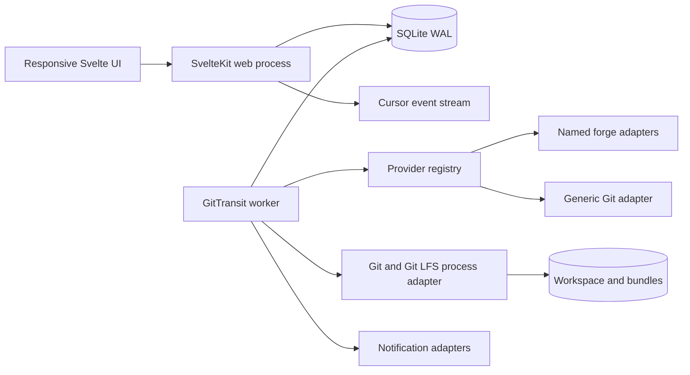
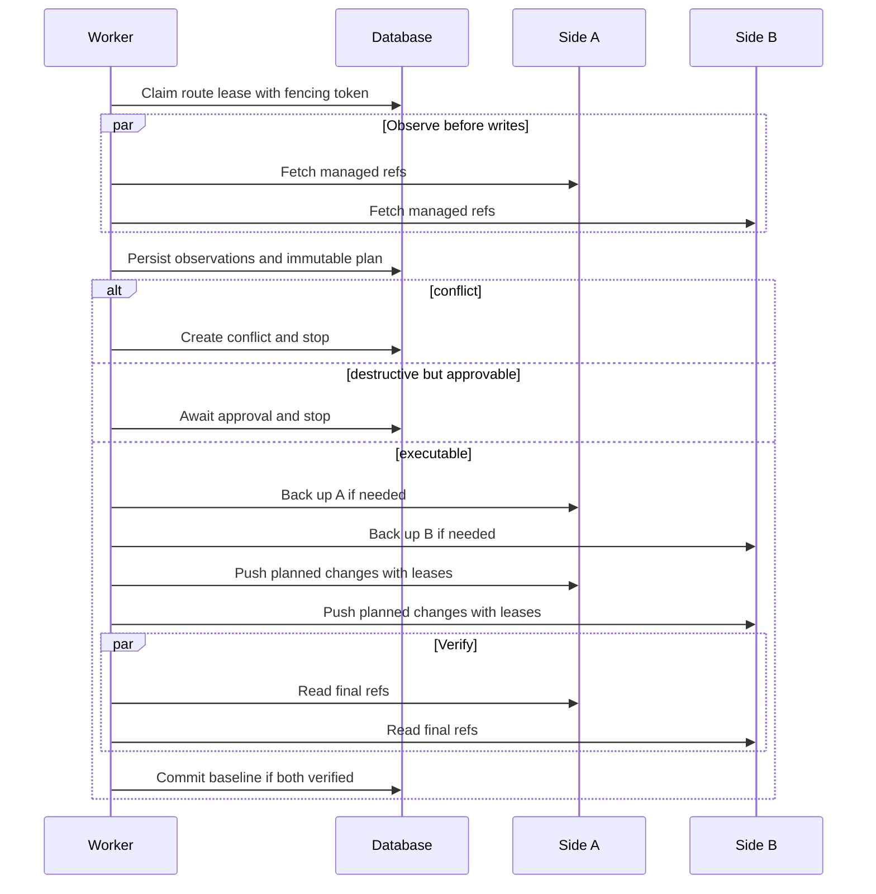

# GitTransit: SvelteKit Reimplementation Guide and Delivery Plan

## Document control

| Field                | Value                                                                                               |
| -------------------- | --------------------------------------------------------------------------------------------------- |
| Product              | GitTransit                                                                                          |
| Target stack         | SvelteKit and TypeScript                                                                            |
| Behavioral reference | `GITEA_MIRROR_IMPLEMENTATION_MODIFIED.MD`                                                           |
| Intended audience    | An implementation agent or engineering team building a fresh application                            |
| Compatibility goal   | Preserve useful operational guarantees, not the old framework, schema, API, or provider assumptions |
| Data migration       | Not required for the first release; this is a fresh-install design                                  |
| Required providers   | GitHub, GitLab, Bitbucket, Gitea, Forgejo, and generic Git                                          |
| Required directions  | One-way and two-way Git-content synchronization                                                     |
| Deferred identity    | OIDC, SAML, OAuth 2.x, and trusted-header authentication                                            |

This document is both a product specification and an implementation sequence. It resolves the generic-execution and bidirectional-sync gaps called out by the reference report. Do not port the legacy GitHub-to-Gitea orchestration and add provider conditionals around it; that would preserve the coupling GitTransit is intended to remove.

## 0. Notes

The UI will use DaisyUI.
Also, we will only support bitbucket-cloud for now for the bitbucket server type (bitbucket-data-center can be added as a generic git provider instead).
All features/implementations will require tests
I want the project created using create-svelte, with playwright for testing. Playwright provides a CLI tool (create-playwright) that helps you quickly scaffold an E2E test setup in your project (https://www.okupter.com/blog/e2e-testing-with-sveltekit-and-playwright)
I also want the project to treat warnings as errors, and enforce strict typing

## 1. Product definition

GitTransit is a self-hosted control plane for discovering, mapping, and synchronizing repositories between independently configured Git services. A connection describes one concrete service instance. A mirror pair connects two connection records and applies selection, namespace, content, safety, and schedule policies. A repository route is the executable mapping of one repository on side A to one repository on side B.

The following are valid first-class configurations:

| Source | Target | Source instance                      | Target instance                      | Direction             |
| ------ | ------ | ------------------------------------ | ------------------------------------ | --------------------- |
| GitHub | Gitea  | `https://github.com`                 | `https://my-gitea-instance.internal` | `=>` source to target |
| GitHub | GitLab | `https://github.com`                 | `https://gitlab.com`                 | `<=>` two way         |
| Gitea  | Gitea  | `https://my-gitea-instance.internal` | `https://localhost:3000`             | `=>` source to target |
| GitLab | Gitea  | `https://gitlab.com`                 | `https://localhost:3000`             | `=>` source to target |

GitHub-to-GitHub, GitLab-to-Bitbucket, Forgejo-to-generic-Git, and other pairings are also valid when negotiated capabilities support the requested operation. The connection IDs must differ, but their provider types may be identical. The malformed example `https:gitlab.com` should be documented as `https://gitlab.com` and rejected if submitted literally.

### 1.1 Meaning of “mirror”

GitTransit separates three content classes:

1. **Git content:** managed branches, tags, annotated tag objects, and their reachable commit/object graph.
2. **Git-adjacent content:** Git LFS objects, wiki repositories, and submodule declarations.
3. **Forge metadata:** settings, topics, releases/assets, labels, milestones, issues/comments, and pull/merge requests.

One-way and two-way support is mandatory for Git content. LFS follows transferred refs when both endpoints support it. Wiki synchronization is a separate Git repository route. Forge metadata is capability-gated and initially one-way only. Two-way issues, releases, or change requests are not implied by `<=>` because vendor IDs, permissions, state machines, and deletion semantics are not symmetric.

The UI must state:

- `=>` means Git refs flow from the configured source to the configured target. Selected metadata can also flow in that direction.
- `<=>` means Git refs are reconciled between both sides. Metadata is off by default and is not bidirectional in the first release.

### 1.2 Product principles

- A connection is an instance, not merely a provider name.
- Provider behavior lives behind adapters; application services never switch on provider names.
- Core Git transport is owned by GitTransit and does not require a vendor-native pull-mirror feature.
- A pair is policy. A repository route is the unit of execution, locking, status, and conflict resolution.
- Discovery and synchronization are separate. Saving a pair never silently changes a remote.
- A previewed plan precedes target creation or destructive changes.
- Long-running work is durable, observable, cancellable between safe steps, and retryable.
- Credentials are encrypted at rest and are never returned after creation.
- Capabilities are detected per connection and intersected per pair.
- Two-way sync is reconciliation against a saved baseline, not two independent one-way jobs.
- Safety defaults favor stopping over losing history.
- The authenticated application is responsive and usable on mobile.
- The initial deployment remains small: no Redis, browser automation, or collection of large provider SDKs is required.

## 2. Scope and deliberate boundaries

### 2.1 Required for the first complete release

| Area                   | Required result                                                                                                  |
| ---------------------- | ---------------------------------------------------------------------------------------------------------------- |
| Local identity         | First-user setup, email/password login, secure database sessions, logout, explicit admin/member role             |
| Connections            | Create, edit, test, disable, and delete connections for every required provider                                  |
| Credentials            | Personal/app token, basic/app password where supported, and SSH private key                                      |
| Discovery              | Paginated inventory for named forges; manual endpoints for generic Git                                           |
| Pairs                  | One-way/two-way pairs, negotiated capabilities, mapping preview, enable/pause                                    |
| Routes                 | Select, map, rename, ignore/include, run, inspect, and remove local mappings                                     |
| Git synchronization    | Branch/tag transfer for every valid pair, including same-provider/different-instance                             |
| Two-way reconciliation | Baselines, divergence detection, conflicts, safe convergence, manual resolution                                  |
| LFS                    | Transfer referenced LFS objects when enabled and supported                                                       |
| Safety                 | Rewrite/deletion classification, leases, backups, approvals, force-with-lease writes                             |
| Automation             | Durable jobs, scheduler, retries, crash recovery, stale-state reconciliation                                     |
| Metadata               | Capability-gated one-way topics, labels, milestones, issues/comments, change requests, releases/assets, and wiki |
| Operations             | Activity, live events, health/readiness, metrics, logs, cleanup, notifications                                   |
| UI                     | Responsive Svelte UI, including a mobile representation of the flow matrix                                       |
| Deployment             | Path prefix, custom CA, nonroot container, persistent data/work/backup volumes                                   |

### 2.2 Deferred, with extension seams only

Do not implement these in the initial project:

- OIDC or SAML login
- OAuth 2.x login, OAuth client administration, or OAuth/OIDC provider mode
- Trusted reverse-proxy header authentication
- Automatic external-identity account linking
- Two-way forge metadata synchronization
- Provider webhooks as a correctness requirement
- Legacy database, session, or ciphertext migration
- Plugin loading or user-supplied executable hooks
- Hosted multi-tenant SaaS mode

Section 14 defines an auth seam so deferred login methods can be added without replacing guards or the session model. A stub means a typed internal contract, reserved configuration namespace, and documentation—not fake public endpoints or placeholder controls that appear functional.

### 2.3 Bitbucket scope

“Bitbucket” is not one API:

- `bitbucket-cloud` is required in the primary provider rollout.
- `bitbucket-data-center` is required before claiming self-hosted Bitbucket support and is a separate adapter because its API, URLs, authentication, pagination, and features differ.

The UI can group them under the Bitbucket brand. Ask for the edition during setup and verify it during connection testing; do not infer it from a failed API call.

## 3. Reference feature disposition

| Reference behavior              | GitTransit treatment                                                                 |
| ------------------------------- | ------------------------------------------------------------------------------------ |
| First-run administrator         | Preserve with an explicit role                                                       |
| GitHub discovery                | Generalize into inventory adapters                                                   |
| Gitea/Forgejo pull mirrors      | Replace with controlled Git fetch/push; native mirroring may be a later optimization |
| Repository/organization records | Replace with connection-scoped repositories, namespaces, and routes                  |
| Servers and matrix              | Promote into the primary model and give it an executor                               |
| Destination naming/overrides    | Preserve as pair defaults and route overrides                                        |
| Force-push detection            | Generalize into per-ref reconciliation and destructive policy                        |
| Bundle backups and approvals    | Preserve for either endpoint                                                         |
| Scheduler/batching              | Preserve with durable leases                                                         |
| Jobs/events/recovery            | Preserve with explicit run and step states                                           |
| Metadata copying                | Preserve where adapters expose compatible operations                                 |
| Orphan cleanup                  | Recast as endpoint reconciliation; fail safe on incomplete discovery                 |
| Notifications                   | Preserve as non-fatal side effects                                                   |
| Advanced authentication         | Defer                                                                                |
| Existing API/schema/frontend    | Do not preserve                                                                      |

Legacy concepts such as “GitHub config,” “Gitea config,” and “mirrored location” must not leak into the core. Starred repositories can be a GitHub discovery filter. A canonical endpoint belongs to a route side.

## 4. Terminology and invariants

### 4.1 Terms

- **Connection:** credentials and endpoints for one forge/Git instance.
- **Provider adapter:** discovery and forge operations for one provider/edition.
- **Capability:** an operation the current credential and server can perform.
- **Namespace:** an organization, user, group/subgroup, workspace, or project.
- **Remote repository:** a connection-scoped inventory entry.
- **Mirror pair:** two ordered connections plus direction and policies.
- **Side A/source:** discovery/default-authority side.
- **Side B/target:** one-way destination; in two-way it remains side B, not a subordinate replica.
- **Repository route:** an executable mapping between one endpoint on each side.
- **Baseline:** ref state saved after successful two-way reconciliation.
- **Run/step:** requested execution and its durable component operations.
- **Conflict:** a state GitTransit refuses to resolve automatically.
- **Backup artifact:** verified Git bundle and manifest made before a destructive write.

### 4.2 Hard invariants

1. A pair’s two connection IDs differ.
2. Connections, pair, route, run, conflict, and artifact share one owner.
3. A connection cannot be deleted while enabled pairs or active jobs reference it.
4. A route is unique by pair and normalized side-A identity.
5. A remote repository is unique by connection/stable ID, with normalized path as a secondary key.
6. A write requires a fresh observation and expected old object ID.
7. A two-way baseline advances only after every required push is verified.
8. Failed/cancelled runs never record successful baselines.
9. Discovery omission alone never proves deletion.
10. Provider-generated refs are excluded unless an adapter marks them portable.
11. Secrets never enter browser page data.
12. Capabilities are rechecked before execution.
13. Only one active mutation lease exists per route.
14. A scheduled pair run cannot overlap itself.

## 5. Target architecture

Use SvelteKit for the web/control plane and a small worker entry point for durable work. Both share server-only domain modules and the deployment image.



### 5.1 Runtime shape

- One SvelteKit `adapter-node` web process.
- One worker process built from the same repository and image.
- SQLite in WAL mode for the initial single-host deployment.
- One persistent data root for database, Git workspaces, and backups.
- No Redis: database jobs plus atomic leases form the queue.
- Multiple workers are allowed only after lease, contention, and rate-limit tests pass.
- A process supervisor may combine web/worker for a single container.

Never start the worker in `hooks.server.ts`. Module initialization can run more than once and gives unsafe scaling/shutdown behavior.

Keep persistence behind tested repository interfaces so PostgreSQL can be added later, but do not overbuild an unused portable ORM layer.

### 5.2 Lean dependency policy

- Prefer platform `fetch` and narrow REST clients over full provider SDKs.
- Use installed `git` and optional `git-lfs` for object transport.
- Prefer SvelteKit form actions/load functions over a second state framework.
- Use scoped Svelte CSS or one build-time CSS system, not overlapping UI suites.
- Use one schema validator and one database layer.
- Justify date, cron, encryption, logging, and password packages separately.
- Put only built output and production dependencies in the runtime image.
- Measure compressed image and unpacked dependencies in CI with a regression budget.

Recommended starting choices are SvelteKit, TypeScript strict mode, `adapter-node`, a lightweight validator, Drizzle with SQLite, and standard crypto APIs. Pin actual versions in the implementation repository.

### 5.3 Layer responsibilities

| Layer                    | Owns                                                 | Must not own                        |
| ------------------------ | ---------------------------------------------------- | ----------------------------------- |
| Svelte components        | Presentation and accessible interaction              | Secrets, provider calls, sync rules |
| SvelteKit routes/actions | Auth, parsing, service calls, responses              | Git commands or worker loops        |
| Application services     | Use cases, transactions, authorization, job creation | Provider response shapes            |
| Domain services          | Mapping, capabilities, ref plans, policies, states   | HTTP/database details               |
| Provider adapters        | URLs, pagination, identities, forge metadata         | Cross-provider orchestration        |
| Git adapter              | Safe commands, refs, ancestry, bundles, LFS          | Pair policy                         |
| Persistence              | Constraints, queries, leases, transactions           | Business decisions                  |
| Worker                   | Job claims, execution, checkpoints, retries          | UI/session behavior                 |

Every application service accepts an explicit actor ID. Never use a body/query `userId` for authority.

## 6. Suggested project layout

```text
src/
  app.d.ts
  app.html
  hooks.server.ts
  lib/
    components/
      navigation/
      connections/
      pairs/
      routes/
      runs/
      conflicts/
      forms/
    client/
      api.ts
      event-stream.ts
      query-state.ts
    shared/
      contracts/
      schemas/
      status.ts
      time.ts
    server/
      auth/
        local.ts
        password.ts
        session.ts
        auth-provider.ts
      application/
        connection-service.ts
        discovery-service.ts
        pair-service.ts
        route-service.ts
        run-service.ts
        conflict-service.ts
      domain/
        capabilities.ts
        mapping.ts
        ref-plan.ts
        safety-policy.ts
        metadata-policy.ts
        state-machines.ts
      providers/
        registry.ts
        types.ts
        github/
        gitlab/
        bitbucket-cloud/
        bitbucket-data-center/
        gitea/
        forgejo/
        generic-git/
      git/
        process.ts
        credentials.ts
        refs.ts
        bundles.ts
        lfs.ts
        workspace.ts
      jobs/
        queue.ts
        worker.ts
        handlers/
        scheduler.ts
        recovery.ts
      metadata/
        coordinator.ts
        topics.ts
        labels.ts
        milestones.ts
        issues.ts
        change-requests.ts
        releases.ts
        wiki.ts
      persistence/
        db.ts
        schema/
        repositories/
        migrations/
      notifications/
      observability/
      security/
  routes/
    (public)/
      login/
      setup/
      health/
    (app)/
      +layout.server.ts
      +layout.svelte
      +page.server.ts
      +page.svelte
      connections/
      pairs/
      repositories/
      runs/
      conflicts/
      settings/
    api/v1/
      connections/
      pairs/
      routes/
      runs/
      conflicts/
      events/
      health/
worker/
  main.ts
tests/
  unit/
  contract/
  integration/
  e2e/
```

Keep route files thin. Reusable visual components belong in `src/lib/components`; domain and persistence code stays in `src/lib/server` so SvelteKit cannot place it in a browser bundle.

## 7. Persistence model

Use sortable opaque IDs such as UUIDv7. Store timestamps as UTC instants. Normalize paths for matching but retain original casing for display. Prefer typed columns for fields used in filtering/locking and versioned JSON for extensible policies.

### 7.1 Identity and installation tables

#### `users`

- ID, normalized unique email, display name
- role: `admin` or `member`
- password hash and parameter/version data
- created/updated/disabled timestamps

#### `sessions`

- ID and user ID
- hash of the random session token, never the token itself
- expiry, last-seen, creation, and revocation times
- optional IP and user-agent audit fields

#### `app_settings`

- installation ID and public base URL/path
- encrypted credential key version
- history/schedule defaults
- reserved inactive `authExtensionConfig`

### 7.2 Connections and inventory

#### `credentials`

- ID and user ID
- kind: token, basic/app-password, or SSH key
- encrypted payload, key version, nonce, authentication tag
- non-secret display hint such as suffix/fingerprint
- created/updated/last-used timestamps

Credentials are separate so rotation does not rewrite pair/job records. Responses expose only `credentialConfigured` and a display hint.

#### `connections`

- ID, user ID, name
- provider adapter ID
- base URL, optional separate API and external URL
- optional LFS URL
- credential ID
- TLS/custom-CA reference and private-network permission
- enabled state
- detected product/version/edition
- versioned capability snapshot and observation time
- last test time/status/safe error code
- timestamps

Unique `(user_id, normalized_name)`. The same instance with two accounts is valid, so URL/provider is not globally unique.

#### `namespaces`

- ID, connection ID, provider-stable external ID
- full/normalized path
- kind: user, organization, group, subgroup, workspace, project
- display metadata, access level, observation timestamps

#### `remote_repositories`

- ID, connection ID, optional namespace ID
- provider-stable external ID where available
- name, full path, normalized full path
- web URL and canonical clone URLs without embedded credentials
- default branch, visibility, archived/disabled/fork flags
- parent identity for forks
- issues/wiki/LFS hints and provider update timestamp
- discovery state and last observed time
- adapter schema version, not an unbounded raw response
- timestamps

Unique `(connection_id, external_id)` when present and `(connection_id, normalized_full_path)` otherwise.

### 7.3 Pair and route tables

#### `mirror_pairs`

- ID, user ID, name
- side-A and side-B connection IDs
- direction: `one-way` or `two-way`
- enabled/paused/draft state
- versioned selection policy
- versioned namespace/naming policy
- versioned Git content policy
- versioned metadata policy
- versioned safety/conflict policy
- versioned schedule policy
- capability snapshot and validation status
- last inventory/run timestamps
- optimistic-lock version and timestamps

Enforce different connection IDs in the database. Same provider types are valid.

#### `repository_routes`

- ID, pair/user IDs
- side-A repository ID
- optional side-B repository ID until matched/created
- planned and canonical side-B namespace/name
- route-level policy overrides
- status: discovered, planned, ready, syncing, synced, conflict, blocked, failed, ignored, missing, archived
- last successful run and safe error/warning summary
- optimistic generation and timestamps

Unique `(pair_id, side_a_repository_id)` and, once assigned, `(pair_id, side_b_repository_id)`.

#### `route_endpoints`

Persist the exact endpoint used on each side:

- route, side, connection, and remote repository IDs
- canonical full path and web URL
- canonical fetch/push URL without credentials
- provider-stable identity
- last verification time

This prevents a rename or rediscovery from silently redirecting a route to an unrelated repository.

### 7.4 Reconciliation and safety

#### `ref_baselines`

- route ID and normalized ref name
- last successful side-A and side-B object IDs
- object kind when known
- baseline generation, successful run ID, timestamps

#### `ref_observations`

- run, route, side, ref name, object ID
- optional peeled object ID for annotated tags
- observed time

#### `conflicts`

- ID, route, run, ref name
- kind: diverged, delete/modify, tag rewrite, protected-ref, destination mismatch, mapping collision, metadata
- baseline/current IDs on both sides
- state: open, resolved, superseded
- resolution, actor, time, optional note

#### `backup_artifacts`

- ID, user, route, run, and protected side
- safe relative path, byte size, digest
- endpoint/ref manifest
- verification status and creation/expiry times

### 7.5 Jobs, events, and metadata

#### `runs`

- ID, user, optional pair/route
- trigger: manual, schedule, retry, recovery, conflict-resolution
- kind: discover, preview, provision, sync, cleanup, metadata
- state: queued, running, awaiting-approval, conflicted, succeeded, partial, failed, cancelled, interrupted
- idempotency key and progress counters
- request/start/heartbeat/completion times
- safe error code/summary and cancellation-request time

#### `run_steps`

- run ID, ordered name, attempt
- state and versioned checkpoint
- lease owner/expiry
- started/heartbeat/completed times
- safe error/warning data

#### `events`

- monotonic cursor ID and user ID
- event type, resource IDs, safe payload
- created/expiry time

Do not mark events globally read. Reconnect with `Last-Event-ID` and converge by refetching canonical data.

#### `metadata_mappings`

- route and component
- source/target provider identities
- stable GitTransit provenance marker
- content digest/version and last successful sync

#### `rate_limits`

- connection and provider resource category
- limit, remaining, reset/retry time, status, observed time

#### `leases`

- resource type/ID
- worker owner ID
- monotonically increasing fencing token
- expiry/heartbeat

A stale worker with an expired fencing token must be unable to commit a baseline after another worker takes over.

### 7.6 Database constraints and indexes

At minimum index:

- every owner foreign key
- pair enabled state and next-run time
- route pair/status/last-success time
- run user/state/queued time and lease expiry
- conflict user/state/created time
- event user/cursor
- remote repository connection/normalized path
- observations route/run/ref

Use foreign keys and transactions. Secrets and artifact files need explicit application cleanup after a transaction commits; never delete a remote repository as a database cascade.

## 8. Provider abstraction

The adapter surface should be narrow and operation-oriented. A provider can implement inventory without implementing metadata, or read an object it cannot create. Capabilities describe directions, not marketing feature names.

```ts
type ProviderId =
	| 'github'
	| 'gitlab'
	| 'bitbucket-cloud'
	| 'bitbucket-data-center'
	| 'gitea'
	| 'forgejo'
	| 'generic-git';

type Capability =
	| 'identity:read'
	| 'namespace:list'
	| 'repository:list'
	| 'repository:read'
	| 'repository:create'
	| 'repository:update'
	| 'git:fetch'
	| 'git:push'
	| 'git:delete-ref'
	| 'lfs:fetch'
	| 'lfs:push'
	| 'topics:read'
	| 'topics:write'
	| 'labels:read'
	| 'labels:write'
	| 'milestones:read'
	| 'milestones:write'
	| 'issues:read'
	| 'issues:write'
	| 'change-requests:read'
	| 'change-requests:write'
	| 'releases:read'
	| 'releases:write'
	| 'wiki:fetch'
	| 'wiki:push';

interface ProviderAdapter {
	readonly id: ProviderId;
	testConnection(ctx: AdapterContext): Promise<ConnectionProbe>;
	discoverCapabilities(ctx: AdapterContext): Promise<CapabilitySet>;
	inventory?: InventoryAdapter;
	repositories?: RepositoryAdminAdapter;
	metadata?: MetadataAdapter;
	normalize(input: RemoteRepositoryInput): NormalizedRepository;
}
```

The Git process adapter is independent:

```ts
interface GitTransport {
	lsRemote(endpoint: AuthenticatedEndpoint): Promise<RefMap>;
	prepareWorkspace(route: RouteContext): Promise<Workspace>;
	fetch(workspace: Workspace, side: Side, refs: ManagedRefPolicy): Promise<RefMap>;
	isAncestor(workspace: Workspace, older: Oid, newer: Oid): Promise<boolean>;
	push(plan: PushPlan, lease: RemoteLease): Promise<PushResult>;
	createBundle(request: BundleRequest): Promise<VerifiedArtifact>;
	transferLfs(request: LfsTransfer): Promise<LfsResult>;
}
```

Provider adapters produce authenticated endpoint descriptions but do not run arbitrary shell strings. The Git adapter receives argument arrays, a controlled environment, timeouts, and redactors.

### 8.1 Provider registry rule

Only `ProviderRegistry` maps an adapter ID to an implementation. Application code requests operations from the registry and reacts to typed capability/operation errors. Never spread clauses such as `if provider === 'github'` through services.

Share a Forgejo/Gitea protocol helper only where tested behavior is identical. Retain separate adapter identities and overrides because the products can diverge.

### 8.2 Capability negotiation

Pair capabilities are the operation-level intersection:

```text
one-way Git = A git:fetch AND B git:push
two-way Git = A git:fetch + git:push AND B git:fetch + git:push
target creation = B repository:create OR a pre-existing mapped endpoint
one-way issues = A issues:read AND B issues:write
one-way LFS = A lfs:fetch AND B lfs:push
```

The saved capability snapshot powers the form, but the worker probes or refreshes stale capabilities before a run. Distinguish:

- adapter supports operation
- server edition/version exposes operation
- credential is authorized
- route/repository settings allow operation

Do not advertise a checkbox from adapter support alone.

### 8.3 Initial capability expectations

This is a design baseline, not a permanent vendor promise:

| Provider              | Inventory   | Create repo         | Git read/write     | Forge metadata            | Notes                                                         |
| --------------------- | ----------- | ------------------- | ------------------ | ------------------------- | ------------------------------------------------------------- |
| GitHub / Enterprise   | API         | Yes with permission | Yes                | Broad                     | Enterprise API URL is connection-specific                     |
| GitLab / self-managed | API         | Yes with permission | Yes                | Broad                     | Preserve subgroup paths; do not rely on paid native mirroring |
| Bitbucket Cloud       | API         | Yes with permission | Yes                | Partial/different model   | Workspace/project semantics; app passwords/tokens             |
| Bitbucket Data Center | API         | Yes with permission | Yes                | Edition/version dependent | Separate adapter and test matrix                              |
| Gitea                 | API         | Yes with permission | Yes                | Broad                     | Version-probe capabilities                                    |
| Forgejo               | API         | Yes with permission | Yes                | Broad                     | Separate identity despite API overlap                         |
| Generic Git           | Manual only | No                  | Endpoint-dependent | None                      | Pre-create destination; optional explicit LFS URL             |

The implementation must verify current vendor contracts against official documentation and adapter fixtures. Where a provider has no equivalent concept, return `unsupported` rather than silently dropping content.

### 8.4 Generic Git behavior

Generic Git is an explicit endpoint adapter:

- no account-wide inventory
- no namespace creation
- no remote repository creation
- no issues/releases/settings APIs
- test using `git ls-remote` with prompts disabled
- support HTTPS credentials or SSH key/known-host configuration
- source and target URLs are entered per repository route
- optional LFS endpoint is explicit

The pair wizard for generic Git goes directly to manual route mapping instead of showing an empty discovery screen.

## 9. Pair policy model

### 9.1 Selection

- all accessible repositories
- selected repositories
- include/exclude glob patterns over normalized full paths
- visibility and archived/fork filters
- provider-specific filters in a namespaced extension object

Named-forge discovery should support the provider equivalents of owned/personal repositories, organization/group/workspace repositories, and collaborator/member access where the API can distinguish them. GitHub starred repositories and named star lists are a GitHub extension, not a core route flag. Preserve separate “discover” and “automatically provision newly selected routes” settings so inventory cannot unexpectedly create remotes.

Selection changes produce a preview. They do not delete routes automatically. A direct manual import by provider path/URL can add or refresh one named-forge repository without waiting for a full scan; it still uses the adapter and all normal ownership/normalization rules.

Fork treatment is explicit:

- `skip`
- `independent-copy`, which mirrors Git content without claiming a forge-native fork relationship
- `native-fork` only when the target adapter can safely create/verify the parent relationship

If the source fork’s parent is not mapped on the target, `native-fork` blocks or falls back only according to an explicit policy.

### 9.2 Namespace and naming

Core strategies:

- `preserve`: preserve the source namespace path where the target supports it
- `single-namespace`: put every route under one target namespace
- `flat-user`: create repositories under one target user
- `map`: explicit source namespace to target namespace rules

Mapping rules have ordered precedence:

1. Route override
2. Exact namespace mapping
3. First matching mapping pattern
4. Pair default strategy

Sanitize target names using the target adapter, not a universal lowest-common-denominator regex. A preview must show transformations and collisions. If an existing target matches the persisted remote identity/source marker, reuse it. Otherwise default to blocking, with explicit choices to rename the new route or map to the existing repository. Persist the canonical path returned by the target.

### 9.3 Git content

- managed refs default to `refs/heads/*` and `refs/tags/*`
- exclude pull/merge-request pseudo refs and provider-internal refs
- optional explicit ref include/exclude rules
- LFS off/auto/on with capability validation
- submodules are copied as Git content; GitTransit does not recursively mirror them
- wiki off/on, implemented as a linked route
- target-side unmanaged branches policy: preserve, delete-with-approval, or error

Do not use an unqualified `git push --mirror` against a forge. It can overwrite provider-owned refs. Generate explicit refspecs from the managed-ref policy.

### 9.4 Safety and conflict defaults

- fast-forward writes: automatic
- new refs: automatic
- non-fast-forward rewrite: backup and approval
- ref deletion: approval
- tag replacement/deletion: approval
- divergent two-way change: conflict, never choose by timestamp
- delete/modify two-way state: conflict
- backup failure when required: block
- target mismatch: block
- remote changed after planning: abort and re-plan

### 9.5 Metadata

Each component is independently off/on/required. “Required” fails the route if unsupported or incomplete; “on” permits a partial run with a warning. A two-way pair must reject a bidirectional metadata configuration. It may permit one-way metadata from side A to side B only after explicit confirmation that side A is the metadata authority.

Content settings use tri-state inheritance:

1. pair default
2. namespace mapping override
3. repository route override

Only non-null override fields replace inherited values. The final capability check can disable an impossible optional component or reject an impossible required component; it never silently enables more content.

### 9.6 Scheduling

- disabled by default until the pair has a valid preview
- duration or cron with IANA timezone
- inventory refresh cadence separate from sync cadence
- batch size, route concurrency, retry attempts/backoff, operation timeout
- skip recently successful routes
- optional auto-provision of newly selected routes
- per-connection API concurrency/rate budget
- next-run timestamp calculated and persisted transactionally

“Concurrent” means route concurrency inside one pair run, never overlapping runs for the same pair.

## 10. End-to-end product flows

### 10.1 First-run setup

1. An empty installation redirects protected routes to `/setup`.
2. The first local user becomes an explicit administrator.
3. Public setup closes atomically in the same transaction as user creation.
4. The user signs in and reaches an empty dashboard with an “Add connection” action.
5. A generated installation/credential encryption key must be supplied as a deployment secret or created in a protected data volume. Production startup must not use a hard-coded fallback.

### 10.2 Create and test a connection

1. Choose provider and, for Bitbucket, edition.
2. Enter display name, instance/API URL, and credential method.
3. For a public SaaS provider, prefill the normal base URL but keep it editable where enterprise/self-hosted variants exist.
4. Validate syntax locally, then submit to a server action.
5. The server tests TLS, server identity, authenticated user, core API access, Git transport, and requested credential scope where observable.
6. It stores the encrypted credential and a versioned capability snapshot.
7. The response returns identity, capabilities, warnings, and a masked credential hint—never the secret.

An empty credential field during edit means “keep existing.” Replacement and removal are explicit actions. Follow redirects only under a strict policy and never forward authorization to a different host.

### 10.3 Create a pair

Use a resumable wizard:

1. **Endpoints:** choose two connection records. Permit same provider, reject same connection ID.
2. **Direction:** choose `=>` or `<=>` and show the exact content guarantee.
3. **Repositories:** load side-A inventory or add manual generic-Git routes.
4. **Mapping:** select namespace strategy and review target paths/collisions.
5. **Content:** choose refs, LFS, wiki, and compatible metadata.
6. **Safety:** choose rewrite/deletion, backup, and conflict policies.
7. **Schedule:** configure or leave manual.
8. **Preview:** validate live capabilities and produce a no-side-effect plan.
9. Save in `ready` state; enabling and running are explicit.

The preview includes:

- selected/skipped repository counts and reasons
- target create/reuse/manual-map decisions
- naming transformations and collisions
- negotiated capabilities and unsupported requested content
- whether each endpoint can fetch and push
- destructive settings and backup storage estimate where calculable
- metadata components and direction

### 10.4 Discovery and inventory refresh

1. Claim a pair discovery job and load side A through its inventory adapter.
2. Paginate with provider-native cursors and enforce rate budgets.
3. Normalize identities, paths, visibility, namespace, clone endpoints, and feature hints.
4. Upsert by stable provider ID, then normalized path.
5. Mark previously observed entries as “not observed this scan,” not deleted.
6. Record whether the scan was complete, filtered, rate-limited, or partially failed.
7. Apply selection policy and create/update route proposals without destroying custom route overrides.
8. Revalidate existing side-B identities when necessary.

Only a direct provider “not found” result after a complete scan can confirm disappearance. Auth errors, timeouts, permission changes, and filtered results are ambiguous and must not archive/delete anything.

### 10.5 Provision a target

For a route with no side-B remote:

1. Recompute and validate the planned namespace/name.
2. Check target identity by stable ID/source provenance where available.
3. Ensure/create the namespace only if policy and capability permit.
4. If target creation is supported, create an empty repository without generated README/license commits.
5. If it is generic Git or cannot create, move to `blocked` with instructions to create/map it.
6. Persist the canonical target identity and URLs returned by the adapter.
7. Queue the initial sync; do not mark `synced` merely because the target exists.

Repository creation is idempotent through a route operation key. A retry after creation must find and reuse the same remote rather than invent a suffixed repository.

## 11. Git transport and synchronization

### 11.1 Managed refs

The default portable set is:

- `refs/heads/*`
- `refs/tags/*`

Optional adapter-reviewed sets can include `refs/notes/*`. Exclude `refs/pull/*`, `refs/merge-requests/*`, change-request refs, pipelines, review refs, replace refs, and forge bookkeeping unless explicitly proven portable.

Represent each operation as an immutable plan:

```ts
type RefAction =
	| { kind: 'create'; ref: string; newOid: Oid; to: Side }
	| { kind: 'fast-forward'; ref: string; oldOid: Oid; newOid: Oid; to: Side }
	| { kind: 'force-update'; ref: string; oldOid: Oid; newOid: Oid; to: Side }
	| { kind: 'delete'; ref: string; oldOid: Oid; from: Side }
	| { kind: 'noop'; ref: string; oid?: Oid }
	| { kind: 'conflict'; ref: string; reason: ConflictKind };
```

Plans contain the observed endpoint identities, capability generation, policy generation, and expected remote OIDs. A changed generation invalidates the plan.

### 11.2 Credential-safe workspace

- Use a deterministic per-route cache directory plus a unique per-run worktree/control area.
- Permit no user input in filesystem paths; derive safe IDs.
- Run commands with argument arrays, terminal prompts disabled, controlled environment, and deadlines.
- Prefer temporary credential helpers/askpass descriptors or restricted files over credentials in URLs or command arguments.
- Do not log environment variables, remote URLs with userinfo, HTTP headers, or raw stderr until redacted.
- Use strict SSH host verification. A connection test can offer the observed fingerprint for explicit trust; never silently set `StrictHostKeyChecking=no`.
- Clean transient credentials on success, failure, cancellation, and startup recovery.
- Validate repository size/free space before large fetch/bundle/LFS work when possible.

The workspace cache is not authoritative. It can be deleted and reconstructed from the two remotes plus the saved baseline.

### 11.3 One-way synchronization algorithm

For side A `=>` side B:

1. Claim the route lease and record a fencing token.
2. Resolve both persisted endpoints and verify remote identities.
3. Fetch managed refs from A and observe refs on B.
4. Build a plan for each ref:
   - missing on B: create
   - same OID: no-op
   - A descends from B: fast-forward B
   - B differs and A does not descend from B: destructive force-update
   - absent on A but present on B: preserve/delete/error according to managed-ref policy
5. Apply safety rules. If approval is needed, persist the plan and observations, move the run to `awaiting-approval`, and release the worker.
6. Create and verify a bundle of B before any approved destructive B change.
7. Re-observe B and execute explicit refspecs using force-with-lease semantics.
8. Transfer LFS objects reachable from transferred refs if enabled.
9. Verify B’s managed refs match the plan.
10. Run enabled metadata components independently.
11. Commit run result, route status, events, and last-success time.

Source-side history changes are not intrinsically “force pushes”; the risk occurs when applying them to B. Record the exact affected refs/OIDs so a later approval cannot authorize a different remote state.

### 11.4 Two-way reconciliation model

Never implement `<=>` as “run A to B, then B to A.” The first half would erase evidence needed by the second. Observe both sides before any write and compare them to the last successful baseline.

For each managed ref, let:

- `A0` and `B0` be the saved baseline OIDs
- `A1` and `B1` be current observations
- missing be an explicit state, not an empty string

The normal baseline after successful convergence has equal OIDs, but store both values to diagnose imported or manually accepted states.

### 11.5 Two-way decision table

| Current state compared with baseline                    | Decision                                                          |
| ------------------------------------------------------- | ----------------------------------------------------------------- |
| Neither side changed                                    | No-op                                                             |
| Only A changed, B unchanged                             | Propagate A to B, subject to rewrite/deletion policy              |
| Only B changed, A unchanged                             | Propagate B to A, subject to rewrite/deletion policy              |
| Both now have the same OID                              | Accept and advance baseline                                       |
| Both changed; A1 is an ancestor of B1                   | Fast-forward A to B1                                              |
| Both changed; B1 is an ancestor of A1                   | Fast-forward B to A1                                              |
| Both changed and neither descends from the other        | Divergence conflict                                               |
| Ref was absent in baseline and exists only on one side  | Create it on the other side                                       |
| Both deleted a previously present ref                   | Accept deletion and advance baseline                              |
| One deleted, the other stayed at baseline               | Propagate deletion only under deletion policy; otherwise approval |
| One deleted, the other changed                          | Delete/modify conflict                                            |
| Tag OID changed                                         | Tag-rewrite approval or conflict; never silently choose           |
| Current remote differs from the observation during push | Abort, supersede plan, fetch, and re-plan                         |

Timestamps never decide winners. Provider update times are not reliable ordering signals and clocks can differ.

### 11.6 Two-way execution sequence



When both sides need changes, no cross-host transaction can make the pushes atomic. Reduce risk by:

- backing up every side that will receive a destructive update
- pushing non-destructive changes before destructive ones
- using `--atomic` for multiple refs when the remote supports it
- using per-ref expected old OIDs
- verifying both sides
- retaining the plan and partial result if the second push fails
- reconciling from actual remotes on retry rather than replaying blindly

A partial two-host write is an explicit `partial` run, not success. The next run observes reality and either finishes convergence or opens a conflict.

### 11.7 First two-way baseline

Enabling two-way for pre-existing repositories needs an initialization mode:

- **Require equality (default):** all managed refs must match before recording a baseline.
- **Seed A to B:** preview one one-way plan, apply safety gates, converge to A, then establish the baseline.
- **Seed B to A:** symmetric explicit option.
- **Per-ref manual resolution:** select winners for mismatched refs, with backups where destructive.

Never guess an initial winner from which repository was configured as “source” after the user chose two-way.

### 11.8 Conflict resolution

Available resolutions depend on current observations:

- keep A for this ref
- keep B for this ref
- accept a specified commit reachable from the fetched graph
- mark as manually resolved after the operator pushes matching refs externally
- keep both branches by creating a new explicitly named branch, then choose the canonical ref
- dismiss/supersede if a new observation makes the conflict stale

Each resolution creates a new run with fresh observations. It does not mutate the old run. A force update or deletion still follows backup policy. Never offer “merge automatically” unless a later feature builds/test-merges commits and the operator opts in.

### 11.9 LFS

- Test `git-lfs` availability at readiness when any enabled route requires LFS.
- For one-way, fetch required/all LFS objects from A and push them to B after refs are accepted.
- For two-way, transfer objects from the side whose ref is being propagated.
- Authenticate LFS endpoints separately where discovery returns different URLs.
- Stream and bound transfers; do not buffer objects in the web process.
- A missing LFS binary or unsupported endpoint is a validation failure for “required,” and a visible warning for “auto.”
- Verify referenced object availability where the provider/protocol permits; Git ref equality alone is not sufficient to claim LFS success.

### 11.10 Wiki and submodules

A wiki is a separate Git remote with its own capability check, endpoint, baseline, and result, linked to the main route. This avoids contaminating main repository refs and permits a partial warning.

Submodule declarations are ordinary committed files. GitTransit copies them but does not rewrite URLs or recursively create routes. A later “dependency graph” feature can propose linked routes without changing core mirror correctness.

## 12. Safety, backups, and deletion

### 12.1 Safety policy

Use explicit strategies:

| Strategy              | Behavior                                                         |
| --------------------- | ---------------------------------------------------------------- |
| `fast-forward-only`   | New/fast-forward refs only; block rewrites and deletions         |
| `backup-and-apply`    | Automatically bundle affected side, then apply destructive plan  |
| `approve-destructive` | Persist exact plan, wait for approval, bundle, revalidate, apply |
| `never-delete`        | Preserve target-only managed refs and report drift               |

Two-way divergence is always a conflict regardless of these strategies. A “prefer side” option may exist only as a deliberate per-pair advanced policy and must still back up overwritten history.

### 12.2 Bundle backups

- Mirror-fetch all refs needed to restore the affected endpoint.
- Run `git bundle create --all` in an isolated bare repository.
- Verify with `git bundle verify`.
- Write to a temporary file and atomically rename after verification.
- Store a digest and manifest with provider/connection/remote IDs, canonical path, refs/OIDs, run, and time.
- Use user/route IDs in filesystem hierarchy, not remote path text.
- Retain newest N, expire older-than-D, and preserve at least one valid artifact.
- A required backup failure blocks the write consistently, including after approval.

Provide a documented restore command/workflow, but keep restore as an explicit administrative operation rather than an automatic rollback that could overwrite new work.

### 12.3 Repository removal/orphans

Pair/route deletion is local-only by default. Remote archive/delete is a separate, strongly confirmed action and initially limited to one-way targets.

For a disappeared remote:

1. Require a complete inventory result.
2. Directly query the saved stable identity/path.
3. Treat only confirmed not-found as missing.
4. Mark the endpoint/route missing and stop schedule execution.
5. Offer remap, archive target, delete target, or keep unmanaged according to policy.

On two-way routes, a missing repository is never automatically propagated as repository deletion. One remaining repository can be used to re-provision the missing endpoint only through a previewed recovery action.

## 13. Forge metadata

### 13.1 General contract

Metadata components have normalized read/write records and provider-specific loss reports. Each imported item gets:

- source provider, connection, repository, type, and stable external ID
- an unobtrusive provenance marker where the destination supports body text
- a row in `metadata_mappings`
- content digest/version for idempotent updates

An adapter must report unsupported or lossy fields. Do not claim parity because both products use the word “milestone” or “release.”

### 13.2 Component order

For one-way side A to side B:

1. topics/repository presentation
2. labels
3. milestones
4. issues and comments
5. pull/merge requests represented using the target capability selected by policy
6. Git tags, then releases and streaming assets
7. wiki Git route

Labels/milestones precede issues because later components reference them. Release creation waits until its tag exists on B. A component can fail without duplicating earlier work on retry.

### 13.3 Pull and merge requests

Open change requests cannot generally be recreated as functional cross-provider requests: branches, reviewers, checks, merge commits, and permissions differ. Support explicit policies:

- `off`
- `archive-as-issue` with provenance, state, branch/base data, comments, and source link
- `native-when-compatible` only for adapter pairs with dedicated contract tests

The default across different providers is `archive-as-issue`. Never present archived issues as active mergeable pull requests.

### 13.4 Deletion and author semantics

- Never delete target metadata simply because it was omitted from a paginated/partial source response.
- Default to closing/marking stale rather than destructive deletion.
- Preserve original author display and URL in provenance; do not impersonate users.
- Preserve source timestamps only where the target permits, otherwise include them in provenance.
- Map visibility and sensitive/confidential states conservatively.
- Rate-limit large migrations and checkpoint per item.

### 13.5 Two-way boundary

For a two-way Git pair, metadata is:

- disabled by default, or
- explicitly side-A-authoritative and synchronized A `=>` B.

The schema reserves per-item side identities and tombstones so a future bidirectional metadata engine can be designed. Do not implement it as alternating one-way copies; that creates duplicates and feedback loops.

## 14. Authentication and authorization

### 14.1 Initial local authentication

Implement only local email/password authentication:

- Atomically allow first-user signup only while no users exist.
- Make the first user an administrator explicitly.
- Let administrators invite/create later local users, or remain documented single-user until that UI is built.
- Hash passwords with a memory-hard password KDF and store its algorithm/parameters with the hash.
- Use opaque random session tokens; store only a token hash.
- Cookies are `HttpOnly`, `SameSite=Lax`, `Secure` outside local HTTP development, path-prefix aware, and rotated after login.
- Enforce expiry, logout/revocation, login throttling, CSRF protection, and safe generic login errors.
- Do not advertise password reset until an actual delivery mechanism exists. Never log reset URLs in production.

All protected SvelteKit layouts call one server-only session resolver and put only safe user identity/role data in `locals`.

### 14.2 Authorization

- Every query includes owner ID unless an explicit admin service operates across owners.
- Nested ownership is rechecked; owning a guessed route ID must not grant access to its pair/connection.
- Event streams are owner-scoped.
- Maintenance actions are owner-scoped or admin-only.
- Credentials can be used only through a connection owned by the same actor.
- Diagnostics and exports redact secrets, authenticated clone URLs, command environments, and provider error bodies.

### 14.3 Deferred authentication seam

Define but do not activate:

```ts
interface LoginProvider {
	readonly id: string;
	begin(request: RequestContext): Promise<LoginRedirect>;
	complete(request: RequestContext): Promise<ExternalPrincipal>;
}

interface IdentityLinker {
	resolveOrCreate(principal: ExternalPrincipal): Promise<UserIdentityResult>;
}
```

Keep local session creation behind an `AuthService` so a later provider can end by creating the same database session. Reserve a future `external_identities` migration with provider ID, subject, issuer, user ID, verified email, and timestamps, but it need not exist in the first physical schema.

Document future additions in `docs/future-auth.md`:

- OIDC discovery, issuer/audience/nonce/PKCE validation
- SAML metadata/signature/replay validation
- OAuth client/provider responsibilities
- trusted-header proxy boundary and allowed-domain policy
- safe identity linking and admin recovery

No initial environment variables, routes, login buttons, or settings forms should imply these features work. A later feature flag can register adapters in the same provider registry.

### 14.4 Forge credentials are not login methods

Personal access tokens, deploy tokens, app passwords, and SSH keys used by connections remain supported. This does not implement OAuth login. In v1 the operator pastes/installs credentials manually; there is no browser authorization-code flow.

## 15. SvelteKit route and UI specification

### 15.1 Page routes

| Route                      | Purpose                                                        |
| -------------------------- | -------------------------------------------------------------- |
| `/setup`                   | First administrator setup; inaccessible after setup            |
| `/login`                   | Local login                                                    |
| `/`                        | Dashboard                                                      |
| `/connections`             | Connection cards/list, status, capability summary              |
| `/connections/new`         | Provider-aware connection wizard                               |
| `/connections/[id]`        | Edit, rotate credential, test, inventory summary               |
| `/pairs`                   | Flow matrix/list with direction and health                     |
| `/pairs/new`               | Pair wizard and dry-run preview                                |
| `/pairs/[id]`              | Pair summary, controls, last runs, capability warnings         |
| `/pairs/[id]/repositories` | Route inventory, mapping, bulk actions                         |
| `/pairs/[id]/settings`     | Policies and schedule                                          |
| `/repositories`            | Cross-pair repository route inventory                          |
| `/repositories/[id]`       | Endpoint/ref/status/history detail                             |
| `/runs`                    | Activity and filters                                           |
| `/runs/[id]`               | Step timeline, plan, logs/errors, artifacts                    |
| `/conflicts`               | Open conflict queue                                            |
| `/conflicts/[id]`          | Ref graph summary and resolution form                          |
| `/settings/general`        | Base behavior, retention, UI preferences                       |
| `/settings/notifications`  | Notification providers/preferences                             |
| `/settings/authentication` | Local account/session settings plus a plain deferred-auth note |

Use SvelteKit route groups so the authenticated layout guards every `(app)` route. Page server loads return bounded, paginated data. Mutations use form actions for progressive enhancement or versioned JSON endpoints for API clients.

The authenticated shell includes light/dark/system theme, 12/24-hour display preference, current version, account/logout controls, and clear worker/connection degradation indicators. Persist harmless visual preferences locally; persist operational preferences on the server.

### 15.2 Dashboard

Show:

- enabled/degraded pair count
- ready/syncing/conflicted/failed route counts
- queued/running jobs
- open destructive approvals/conflicts
- next scheduled run
- connection health/rate-limit warnings
- recent activity

The dashboard must not query unscoped data during SSR. Each card links to a filtered canonical list.

### 15.3 Connections experience

Connection cards show provider/edition, instance host, authenticated identity, last test, capability health, and how many pairs reference the connection. Editing never displays a saved token/key.

Connection test results distinguish:

- DNS/TCP/TLS failure
- wrong product/edition
- authentication failure
- insufficient API scope
- fetch/push limitations
- unsupported capability
- rate limitation

Do not dump provider response bodies into a toast. Put safe detail in an expandable diagnostic panel.

### 15.4 Flow matrix

Desktop can use a table:

| Source | Target | Source instance | Target instance | Mirror type | Status | Next run | Actions |
| ------ | ------ | --------------- | --------------- | ----------- | ------ | -------- | ------- |

Provider icons never replace text. Render direction as both arrow and words. Same-provider pairs must show instance hosts prominently.

On mobile, each row becomes a card:

```text
GitHub  github.com
   ⇄    Two-way Git
GitLab  gitlab.com

12 routes · 1 conflict
Next run: in 2 hours
[View] [Run]
```

Do not squeeze the desktop table into horizontal scrolling as the only mobile solution.

### 15.5 Repository route screen

Each route shows:

- side-A provider/path and side-B provider/path
- direction
- Git/LFS/metadata status separately
- last successful/attempted times
- changed/conflicting ref count
- pending approval, warning, or safe error

Filters belong in URL query parameters: pair, provider, status, direction, namespace, text, and content warning. Bulk actions act only on selected IDs re-authorized on the server. For large inventories, paginate on the server; virtualization is optional and not a replacement for pagination.

### 15.6 Conflict UI

Show baseline/current abbreviated OIDs, branch/tag, which sides changed, ancestry result, and whether resolution overwrites/deletes history. Link to each provider’s commit/ref view where a safe URL can be constructed.

The primary actions name outcomes (“Use GitHub version on both sides”), not implementation commands (“force push”). Require a typed repository/ref confirmation for destructive multi-ref resolutions. Display the required backup policy before confirmation.

### 15.7 Responsive behavior

The whole application, not only the matrix page, must be mobile-responsive:

- mobile-first layouts from roughly 320 CSS pixels upward
- one-column forms/cards on narrow screens
- sidebar becomes an accessible drawer; no essential action appears only on hover
- dialogs become full-height sheets when space is limited
- sticky bottom action area for long wizards, respecting safe-area insets
- touch targets at least 44 by 44 CSS pixels
- tables provide card/list alternatives or deliberate contained scrolling
- filters collapse into a sheet with an active-filter count
- long URLs/paths wrap or middle-truncate without widening the viewport
- code/OID displays remain selectable and accessible
- validation appears next to fields and in a focusable summary
- keyboard navigation, visible focus, semantic labels, reduced motion, and sufficient contrast

Use CSS container/grid queries where useful, but verify actual content at narrow, medium, and wide viewport tests. “Responsive” is an acceptance criterion, not a final styling pass.

### 15.8 Svelte interaction rules

- Prefer server-rendered first loads.
- Use form actions with `use:enhance` for mutations needing progressive enhancement.
- Keep wizard draft state in a validated server-side draft record or session-scoped store, not only in browser memory.
- Use small local Svelte state for transient UI.
- Reconnect SSE with backoff and refetch affected resources after gaps.
- Do not poll every page every three seconds. Live events invalidate/refetch focused data.
- Return stable error codes; translate to human copy in one UI error catalog.
- Use optimistic UI only for reversible local actions such as pause/resume, then reconcile server state.

The runs view supports filtering, safe CSV/JSON export, cancellation, retry, and retention-aware clearing. Exported errors/details pass through the same redactor as APIs and logs. Clearing history cannot delete an active run, current baseline, open conflict, or backup artifact still protected by retention.

## 16. HTTP and action contract

Use a versioned `/api/v1` for programmatic/background interactions. HTML form actions may call the same application services. All non-health endpoints require a session.

### 16.1 Connections

| Method/path                                 | Behavior                                                     |
| ------------------------------------------- | ------------------------------------------------------------ |
| `GET /api/v1/connections`                   | Paginated owned connection summaries, no secrets             |
| `POST /api/v1/connections/test`             | Test unsaved settings using a transient credential           |
| `POST /api/v1/connections`                  | Test/validate, encrypt credential, create                    |
| `GET /api/v1/connections/:id`               | Safe detail and capabilities                                 |
| `PATCH /api/v1/connections/:id`             | Edit non-secret fields with optimistic version               |
| `PUT /api/v1/connections/:id/credential`    | Explicit credential replace                                  |
| `DELETE /api/v1/connections/:id/credential` | Remove only when no enabled operation needs it               |
| `POST /api/v1/connections/:id/test`         | Re-test stored connection                                    |
| `POST /api/v1/connections/:id/discover`     | Enqueue inventory job                                        |
| `GET /api/v1/connections/:id/namespaces`    | Paginated namespace inventory                                |
| `GET /api/v1/connections/:id/repositories`  | Paginated repository inventory                               |
| `DELETE /api/v1/connections/:id`            | Delete only after dependency check; never touch remote repos |

### 16.2 Pairs and routes

| Method/path                              | Behavior                                                        |
| ---------------------------------------- | --------------------------------------------------------------- |
| `GET /api/v1/pairs`                      | List owned pairs with safe endpoint summaries                   |
| `POST /api/v1/pairs/preview`             | Capability/mapping dry run without remote mutation              |
| `POST /api/v1/pairs`                     | Create draft/ready pair                                         |
| `GET /api/v1/pairs/:id`                  | Pair, policies, capabilities, health                            |
| `PATCH /api/v1/pairs/:id`                | Validated versioned update                                      |
| `POST /api/v1/pairs/:id/enable`          | Revalidate and enable                                           |
| `POST /api/v1/pairs/:id/pause`           | Pause future claims, not an unsafe mid-push kill                |
| `POST /api/v1/pairs/:id/run`             | Enqueue pair run; return 202 and run ID                         |
| `GET /api/v1/pairs/:id/routes`           | Paginated routes                                                |
| `POST /api/v1/pairs/:id/routes/preview`  | Preview selection/mapping changes                               |
| `POST /api/v1/pairs/:id/routes`          | Create manual route, especially generic Git                     |
| `PATCH /api/v1/routes/:id`               | Route override/include/remap update                             |
| `POST /api/v1/routes/:id/provision`      | Enqueue target create/match                                     |
| `POST /api/v1/routes/:id/run`            | Enqueue route sync                                              |
| `POST /api/v1/routes/:id/reset-baseline` | Guarded two-way re-initialization flow                          |
| `DELETE /api/v1/routes/:id`              | Local-only removal unless a distinct remote action is confirmed |

### 16.3 Runs, conflicts, events

| Method/path                          | Behavior                                                  |
| ------------------------------------ | --------------------------------------------------------- |
| `GET /api/v1/runs`                   | Paginated/filterable activity                             |
| `GET /api/v1/runs/:id`               | Safe run plan, steps, warnings, artifacts                 |
| `POST /api/v1/runs/:id/cancel`       | Request cancellation at next safe boundary                |
| `POST /api/v1/runs/:id/retry`        | New run linked to the prior attempt                       |
| `GET /api/v1/conflicts`              | Paginated open/resolved conflicts                         |
| `GET /api/v1/conflicts/:id`          | Current safe resolution context                           |
| `POST /api/v1/conflicts/:id/resolve` | Validate choice and enqueue fresh run                     |
| `GET /api/v1/events`                 | User-scoped SSE with cursor resume/heartbeat              |
| `GET /api/v1/health`                 | Sanitized liveness                                        |
| `GET /api/v1/ready`                  | DB, migrations, worker heartbeat, required Git/LFS checks |

### 16.4 API conventions

- Stable envelope with `data` or `error: { code, message, fieldErrors?, requestId }`.
- `202 Accepted` plus run ID for long work.
- Cursor pagination for provider-sized lists.
- `Idempotency-Key` accepted for create/enqueue operations.
- ETag or body version required for pair/route policy edits.
- `409` for stale versions, duplicate mappings, and live-state conflicts.
- `422` for capability/policy combinations that are syntactically valid but impossible.
- `429` retains provider retry information without leaking provider credentials.
- Request/response schemas shared between server and Svelte forms where safe.
- Path-prefix-aware URLs generated centrally; never hard-code root-relative links.

## 17. Durable jobs, scheduling, and recovery

### 17.1 Job graph

A pair run expands into route runs; a route run expands into ordered/checkpointed steps:

```text
pair run
  refresh inventory (optional)
  calculate selected routes
  for each route within concurrency limit
    validate endpoints and capabilities
    provision target (when needed and authorized)
    observe/fetch both sides
    calculate immutable ref plan
    wait for approval or conflict resolution (when needed)
    create/verify backups
    apply Git pushes
    transfer LFS
    verify refs and LFS result
    synchronize metadata components
    persist success/baseline
  aggregate result
  emit notification
```

Pair result is:

- `succeeded` when all selected routes succeed/no-op
- `partial` when at least one succeeds and another warns/fails/conflicts
- `failed` when no required route succeeds or the pair-level operation fails
- `conflicted` only at route level; the pair aggregation records conflict count

### 17.2 Atomic claim and lease

The worker:

1. Starts a short transaction.
2. Selects an eligible queued step by priority and creation time.
3. Updates it with worker ID, lease expiry, attempt, and new fencing token only if still claimable.
4. Commits before external work.
5. Heartbeats at a bounded interval shorter than lease duration.
6. Verifies fencing token inside every checkpoint/finalization transaction.

Use database time for leases. Do not hold a database transaction open during Git/API work.

### 17.3 Checkpoints

Checkpoint after:

- endpoint/capability validation
- successful inventory page cursor
- completed fetch/observations
- immutable plan persistence
- backup verification
- each remote push result
- LFS result
- each metadata page/item batch
- final verification

A retry starts by observing remote reality. It can reuse verified artifacts and immutable source reads, but never assumes an earlier push failed merely because the worker did not record completion.

### 17.4 Retry classification

| Class           | Examples                                                      | Action                                                            |
| --------------- | ------------------------------------------------------------- | ----------------------------------------------------------------- |
| Transient       | timeout, DNS interruption, 429, provider 5xx, lock contention | Retry with jitter/backoff and provider retry time                 |
| Authentication  | invalid/expired token, rejected SSH key                       | Fail/degrade connection; no automatic rapid retry                 |
| Permission      | protected branch, missing write/create scope                  | Block route with remediation                                      |
| Capability      | API/version lacks operation                                   | Validation failure; disable requested component or change mapping |
| Conflict        | two-way divergence, stale remote lease                        | Persist conflict or immediately re-plan for stale lease           |
| Safety          | required backup failed, deletion needs approval               | Block/await approval                                              |
| Permanent input | invalid URL/path/pattern                                      | Fail validation before queueing                                   |
| Local resource  | disk full, missing Git/LFS, corrupt workspace                 | Mark readiness degraded; clean/rebuild where safe                 |

Centralize retry policy. Provider adapters return typed errors with safe messages and optional retry times.

### 17.5 Cancellation and pause

- Cancellation is cooperative between steps and between bounded batches.
- Never kill a Git push simply because the browser disconnected.
- A cancelled pair run stops claiming new route steps, lets current non-interruptible pushes finish, then verifies their outcome.
- Pausing a pair prevents new scheduled/manual pair work but does not erase queued approval/conflict state.
- Shutdown stops claims, requests safe checkpoints, and expires/releases leases after bounded grace.

### 17.6 Scheduler

The scheduler is a job producer, not a second execution engine:

1. Acquire a scheduler leadership lease.
2. Find enabled due pairs with no active pair run.
3. Atomically advance next-run and enqueue an idempotent run.
4. Respect connection rate limits and configurable quiet windows.
5. Wake based on nearest due time with a maximum poll interval.

Compute cron schedules in the configured IANA timezone and persist UTC instants. Test daylight-saving gaps/folds. Inventory and repository synchronization can have separate schedules; default to inventory first in a scheduled run.

### 17.7 Startup recovery

- Mark expired running steps `interrupted`.
- Reconcile routes stuck in `syncing` against active leases.
- Remove transient credential files and abandoned run workspaces after proving no live lease.
- Requeue retryable interrupted steps within attempt limits.
- Observe both remotes before continuing any push-related step.
- Never advance a baseline from a stale checkpoint.
- Repair pair/route projected status from canonical runs/conflicts.

Recovery must be safe to invoke repeatedly and concurrently; leadership/leases ensure one repair owns a record.

### 17.8 Events and live updates

Write events in the same transaction as state changes. The SSE endpoint:

- authenticates before streaming
- scopes by user
- accepts `Last-Event-ID`
- sends an initial cursor and periodic heartbeat
- stops timers/queries at disconnect
- emits resource IDs and summary state, not secrets or huge logs
- detects an expired cursor and instructs the client to refetch

The event table has time/count retention. It is not the audit history; runs remain the durable source of truth.

### 17.9 Notifications

Retain the reference notification options as optional adapters:

- ntfy
- Apprise
- Gotify
- generic signed webhook

Notify on configurable success, partial, failure, conflict, and approval-needed events. Decrypt only the selected provider credential for dispatch. Notification failure adds a warning/event but never changes a successful mirror result. Sign generic webhooks, bound payload size, block redirects carrying secrets, and apply SSRF policy.

### 17.10 Cleanup

Separate cleanup jobs:

- run/event history retention
- stale workspace cache
- expired transient credential files
- backup retention
- old ref observations while retaining current baselines/conflicts
- stale inventory entries after confirmed deletion

Each supports dry-run and reports actual affected counts/bytes. Cleanup is user-scoped unless it is an explicit admin filesystem/database maintenance job.

## 18. Security requirements

### 18.1 Credential storage and key management

- Use authenticated encryption with a dedicated deployment key.
- Include key version and support staged rotation.
- Bind ciphertext to owner/credential ID as associated data.
- Reject plaintext fallback on new installs.
- Keep the key outside the database.
- Zero/shorten secret lifetime where practical.
- Return masked state only; no “decrypt existing token into edit form.”

### 18.2 URL and network policy

GitTransit must reach internal hosts by design, so blanket private-IP blocking is incorrect. Use a deliberate policy:

- Only administrators may allow a connection to private/link-local/loopback networks by default.
- Validate `http`/`https` for forge APIs and permitted Git schemes.
- Disable local filesystem and `file:` Git URLs unless a deployment-level allowlist enables them.
- Resolve and validate every redirect target; never forward auth cross-host.
- Defend against DNS rebinding by validating resolved addresses at connection and request time where feasible.
- Block cloud metadata/link-local addresses by default even when private networking is enabled.
- Bound response size/time and API pagination.
- Support custom CA bundles as secret/config references, not a global “disable TLS verification.”

The UI should warn that `localhost` inside a container refers to that container. Compose/service DNS or an explicit host gateway may be required for the example Gitea target.

### 18.3 Git/process safety

- No shell interpolation; executable plus argument array only.
- Fixed allowlist of Git subcommands/options generated by code.
- Reject ref names with `git check-ref-format` semantics.
- Disable hooks and global/system config influence where possible.
- Set controlled `HOME`/Git config directory for the process without repurposing the real runtime home.
- Disable interactive credential prompts.
- Limit concurrency, command duration, output bytes, workspace size, and LFS transfer behavior.
- Redact credentials before persisting errors.
- Never trust a remote repository to provide an executable hook/config.
- Run the container as nonroot with writable access only to required data paths.

### 18.4 Web security

- SvelteKit CSRF/origin checks plus same-site sessions.
- Strict CSP compatible with Svelte output; no unsafe inline script unless nonce-based.
- Security headers: frame denial, nosniff, referrer policy, permissions policy.
- Escape provider/user content; sanitize any rendered Markdown/HTML.
- Rate-limit login, connection tests, previews, and job enqueue operations.
- Require recent authentication for credential replacement and destructive conflict resolution where practical.
- Audit admin, credential, pair, approval, conflict, and remote-delete actions.

### 18.5 Tenant isolation

Add negative tests for every resource ID. Job handlers load the owner from the job and validate all referenced records in one owner-scoped query. Do not rely on UI-hidden IDs or a route fetched before authorization.

## 19. Configuration, observability, and deployment

### 19.1 Environment configuration

Keep environment inputs small and installation-oriented:

| Variable                              | Purpose                                                             |
| ------------------------------------- | ------------------------------------------------------------------- |
| `GITTRANSIT_BASE_URL`                 | Public origin plus optional path prefix                             |
| `GITTRANSIT_HOST` / `GITTRANSIT_PORT` | Listener                                                            |
| `GITTRANSIT_DATABASE_URL`             | SQLite path/URL                                                     |
| `GITTRANSIT_DATA_DIR`                 | Controlled work/artifact root                                       |
| `GITTRANSIT_ENCRYPTION_KEY_FILE`      | Dedicated credential key file/secret                                |
| `GITTRANSIT_LOG_LEVEL`                | Structured logging level                                            |
| `GITTRANSIT_WORKER_CONCURRENCY`       | Global route concurrency                                            |
| `GITTRANSIT_TRUST_PROXY`              | Explicit proxy-hop trust for client IP/scheme only, not header auth |
| `GITTRANSIT_CA_BUNDLE`                | Optional application CA bundle                                      |
| `GITTRANSIT_GIT_PATH`                 | Optional explicit Git executable                                    |
| `GITTRANSIT_GIT_LFS_PATH`             | Optional explicit Git LFS executable                                |

Provider credentials, pair policies, schedules, and notification secrets belong in encrypted database records rather than a sprawling provider-specific environment schema. Environment bootstrap/import can be added later as an explicit idempotent command.

Validate units and ranges at startup. A path prefix must affect pages, assets, form actions, API URLs, cookies, SSE, redirects, and generated callback-like links consistently.

### 19.2 Logs

Structured fields:

- timestamp, level, service/process
- request/run/step IDs
- user/connection/pair/route IDs
- provider and safe host
- operation, attempt, duration
- result/error code and retry class

Never log credentials, authenticated URLs, authorization headers, cookies, full provider response bodies, SSH private material, or raw notification secrets. Maintain a central recursive redactor and test it with encoded URL/userinfo variants.

### 19.3 Metrics

At minimum:

- queued/running jobs and oldest queue age
- run/step duration and outcomes
- routes by status
- open conflicts/approvals
- provider requests/errors/rate-limit remaining
- Git fetch/push/LFS bytes and durations when observable
- backup count/bytes/failures
- worker/scheduler heartbeat and lease expiry
- event-stream clients/reconnect gaps
- database operation latency/lock waits

Metrics labels must be bounded. Do not label by repository path, user email, token, error message, or run ID.

### 19.4 Health and readiness

`/health` proves the web process can respond and returns only status/version/time. `/ready` checks:

- database/migration state
- encryption key availability
- writable data/work directories
- Git executable/version
- Git LFS only when an enabled policy requires it
- recent worker heartbeat when work is enabled

Provider outages do not make the web process unready; they degrade individual connections.

### 19.5 Container and image

Use a multi-stage build:

1. Install exact locked dependencies.
2. Build SvelteKit web output and worker entry.
3. Copy only compiled output, required production dependencies, migrations, licenses, and startup script.
4. Install/copy only runtime Git, CA certificates, SSH client, and optional Git LFS.
5. Run as a numeric nonroot user.

Do not copy the source tree, package-manager cache, dev dependencies, test fixtures, or a full build-stage `node_modules`. Produce an SBOM and scan the final image. CI should inspect largest paths/layers and fail an agreed size regression, while recognizing that Git/Git LFS and the JavaScript runtime set a lower bound.

Recommended volumes:

- `/data/db`
- `/data/work`
- `/data/backups`
- optional read-only `/data/certs`

Workspace and backup locations must be on filesystems that support atomic rename. Document backup export separately from database backup; both are needed for complete operational recovery.

### 19.6 Graceful shutdown

On SIGTERM:

1. Web stops accepting new mutation requests.
2. Worker stops claiming steps.
3. Active steps reach a safe boundary/checkpoint within a configured grace period.
4. Non-interruptible Git operations either finish or are recorded as interrupted for observation-based recovery.
5. Database closes after heartbeats/checkpoints flush.

Container orchestration must grant enough termination grace for typical ref pushes; correctness still cannot assume the process survives.

## 20. Testing strategy

Testing is organized around contracts and failure states, not only happy-path UI snapshots.

### 20.1 Unit tests

- URL/path/ref normalization
- connection and pair schemas
- capability intersection
- namespace mapping precedence and target sanitization
- selection globs and provider extensions
- status transition guards
- one-way ref planner
- full two-way decision table, including missing refs
- ancestry-driven safe convergence
- safety/backup decision table
- cron/duration/timezone calculation
- retry classification/backoff
- credential redaction
- metadata provenance/deduplication
- path-prefix generation

Use table-driven tests for ref planning. Property tests should verify that:

- no plan writes to A in one-way mode
- no successful two-way plan leaves managed refs unequal
- a conflict plan contains no write action for that ref
- any force/delete action is marked destructive
- changing an expected remote OID makes the push lease fail

### 20.2 Provider contract suites

Every adapter runs the same applicable contract:

- test valid/invalid credential
- discover identity/capabilities
- paginate namespaces/repositories without duplicates
- normalize stable identities/casing
- find repository by ID/path
- create empty repository idempotently where supported
- resolve clone/push/LFS/wiki endpoints
- classify not-found/auth/permission/rate/server errors
- preserve auth boundary on redirects
- metadata read/write idempotency for declared components

Use recorded/synthetic provider fixtures with secrets removed. Add dedicated cases for provider pagination, renamed repositories, subgroup/workspace/project mapping, protected branches, and version-dependent APIs.

### 20.3 Git integration tests

Run against temporary local bare repositories:

- initial one-way branch/tag copy
- fast-forward update
- source force rewrite
- source branch/tag deletion
- target-only ref under preserve/delete/error policies
- stale expected OID
- annotated tags and notes policy
- partial multi-ref/atomic behavior
- LFS object transfer when binary is present
- bundle creation, verification, digest, restore
- SSH/HTTPS credential redaction via fake transports

Two-way scenarios:

- no changes
- A-only and B-only fast forwards
- same commit reached independently
- both changed where one tip descends from the other
- true divergence
- create/create same and different
- delete/unchanged, delete/delete, delete/modify
- tag rewrite
- partial first-side push then second-side failure
- crash after push before checkpoint
- external remote update between plan and push
- seed equality/A-wins/B-wins initialization

### 20.4 Persistence/job tests

- owner isolation for every repository method
- uniqueness/cascade restrictions
- atomic first-user setup
- session expiry/revocation
- job claim races
- lease expiry and fencing tokens
- heartbeat/recovery
- idempotency keys
- checkpoint resume after each step
- cancellation around fetch/backup/push/metadata
- scheduler non-overlap and DST
- SSE cursor resume/expiration/multi-tab behavior
- cleanup dry run and actual counts

Use a real SQLite database and migrations for integration tests, not an in-memory mock with different locking semantics.

### 20.5 SvelteKit/API tests

- auth redirects and status codes
- secret-free load/action/API responses
- field errors and stale optimistic versions
- pair preview has no remote side effects
- long work returns 202
- ownership checks for guessed IDs
- API same-connection rejection but same-provider acceptance
- path prefix across assets, cookies, forms, APIs, and SSE
- progressive-enhancement forms work without client JavaScript for core setup/login/create actions

### 20.6 Browser/accessibility/responsive tests

Use browser tests at representative narrow, tablet, and desktop viewports:

- setup/login
- add/test every connection form variant
- one-way and two-way pair wizard
- desktop matrix table and mobile matrix cards
- route filters/bulk actions
- conflict resolution and destructive confirmation
- event reconnect and eventual refetch
- keyboard-only navigation and focus restoration
- drawer/dialog/sheet scroll and escape behavior
- no viewport overflow at 320 CSS pixels
- automated accessibility scan plus manual screen-reader labeling review

Do not approve responsiveness solely from screenshots. Interact with controls at each width.

### 20.7 End-to-end provider matrix

Use disposable self-hosted fixtures in CI where practical:

- Gitea
- Forgejo
- GitLab
- generic bare Git over authenticated HTTP/SSH

GitHub.com and Bitbucket Cloud use deterministic API contract fakes in normal CI plus opt-in secret-backed smoke tests. Bitbucket Data Center needs a licensed/test fixture or an explicitly maintained compatible contract harness before its support badge is enabled.

Every provider must pass both roles:

- provider as side A/fetch source
- provider as side B/push target

Named forges must also pass inventory and target provisioning where supported.

## 21. Implementation plan

Each phase ends in usable, tested behavior. Avoid building all UI first and connecting it to a generic executor at the end.

### Phase 0 — Contract freeze and technical spikes

Tasks:

1. Create a new GitTransit repository/workspace and pin the SvelteKit/TypeScript/runtime toolchain.
2. Turn sections 7–13 into TypeScript domain types and decision-table tests.
3. Spike safe Git credential injection for HTTPS, SSH, and LFS without leaking process arguments/logs.
4. Spike SQLite WAL job claims and fencing with two worker processes.
5. Prove explicit-ref one-way and baseline-based two-way sync using local bare repositories.
6. Decide the password KDF, validator, database library, logger, cron parser, and CSS approach with a dependency-size record.
7. Create architecture decision records for Git transport, two-process runtime, metadata boundary, Bitbucket editions, and local-only identity.

Exit criteria:

- Ref-planner tests cover every row in section 11.5.
- A throwaway two-way demo detects divergence without modifying either remote.
- A stale worker cannot finalize a fenced job.
- Credential values do not appear in process listings, captured logs, or errors.

### Phase 1 — SvelteKit foundation, local auth, and responsive shell

Tasks:

1. Scaffold SvelteKit, strict TypeScript, adapter-node, test tooling, and migrations.
2. Implement configuration/base-path handling.
3. Add users/sessions, first-user setup, local login/logout, roles, guards, and throttling.
4. Add credential encryption service and key validation.
5. Build public and authenticated layouts, responsive navigation, theme/accessibility foundations, and safe error catalog.
6. Add sanitized health/readiness and structured request logging.
7. Establish CI for tests, dependency audit, final-image scan, and size reporting.

Exit criteria:

- Setup closes after the first admin transaction.
- Auth/ownership/path-prefix tests pass.
- Empty dashboard works at mobile/desktop widths.
- No secret can be retrieved through an edit/load response.
- Nonroot production image starts with only documented writable paths.

### Phase 2 — Persistence, jobs, events, and provider skeleton

Tasks:

1. Add connection, namespace, remote repository, pair, route, run/step, event, lease, baseline, conflict, and artifact migrations.
2. Implement owner-scoped repositories and transaction helpers.
3. Implement database job claim/heartbeat/checkpoint/retry/cancel/recovery.
4. Compile a separate worker entry.
5. Implement cursor SSE and client invalidation/refetch.
6. Define provider/Git/metadata interfaces, registry, fake adapter, and contract suite.
7. Build connections list/create/edit/test UI using the fake and generic adapters.

Exit criteria:

- Two workers cannot own one route step concurrently.
- Interrupted jobs recover without false success.
- Multi-tab SSE does not consume another tab’s events.
- Connection secrets stay encrypted/masked.

### Phase 3 — Generic Git transport and manual routes

Tasks:

1. Implement controlled Git process, workspace, ref inventory, ancestry, explicit push, and verification.
2. Implement HTTPS/basic-token and SSH key/known-host credential paths.
3. Implement generic Git connection test and manual endpoint mapping.
4. Implement pair policies, preview, manual route UI, and one-way planner/executor.
5. Implement LFS detection/transfer and wiki-as-linked-route primitives.
6. Implement bundle artifacts and restore documentation.

Exit criteria:

- Two generic bare remotes can be mirrored one way safely.
- Fast-forward, force rewrite, deletion, stale lease, LFS, and backup tests pass.
- No use of unfiltered `push --mirror`.
- A generic target must be pre-created and the UI explains that correctly.

### Phase 4 — Named provider connections and discovery

Implement in this order to maximize reusable test fixtures:

1. Gitea
2. Forgejo
3. GitLab
4. GitHub/GitHub Enterprise
5. Bitbucket Cloud
6. Bitbucket Data Center

For each:

- connection identity/version test
- API and clone URL handling
- capability probe with credential-aware permissions
- namespace/repository pagination and normalization
- find/create empty repository
- rate/error normalization
- source and target Git endpoint contract
- adapter contract suite and UI branding/form fields

Exit criteria:

- Each provider can occupy either side of a pair for Git transport.
- Same-provider/different-instance routes work.
- Subgroups/workspaces/projects map without losing identity.
- Unsupported features are disabled with reasons.
- Support is not enabled for an adapter lacking its contract suite.

### Phase 5 — Pair wizard, inventory, provisioning, and one-way product

Tasks:

1. Complete the pair wizard, capability negotiation, dry-run mapping, collision resolution, and policy persistence.
2. Implement discovery refresh and route proposal/upsert.
3. Implement provider-neutral target provisioning and canonical endpoint persistence.
4. Execute pair batches with rate/concurrency budgets.
5. Build pair matrix, route inventory/detail, run detail, filters, and bulk actions.
6. Implement schedules and manual runs.
7. Add missing-endpoint/orphan reconciliation with safe defaults.

Exit criteria:

- Every requested example works one-way where direction is `=>`.
- Saving/previewing a pair causes no remote mutation.
- Retry after remote creation never creates a duplicate.
- Same provider type is allowed; same connection ID is rejected by UI, API, and database.
- Mobile flows complete without horizontal-page overflow.

### Phase 6 — Destructive protection and operational recovery

Tasks:

1. Integrate destructive classification with pair policies.
2. Add approval UI/API using immutable plans.
3. Complete verified bundle retention and artifact display.
4. Add graceful shutdown and all-step recovery tests.
5. Add scheduler leadership, stale projection repair, cleanup, and disk-pressure behavior.
6. Add metrics and worker readiness/heartbeat.

Exit criteria:

- Required backup failure always blocks.
- Approval cannot apply to changed remote OIDs.
- Crash after each external side effect recovers from observed reality.
- False orphan conditions do not alter endpoints.

### Phase 7 — True two-way Git reconciliation

Tasks:

1. Persist ref observations/baselines and implement the complete two-way planner.
2. Implement equality/A-seed/B-seed/manual baseline initialization.
3. Implement two-sided execution, partial-result recovery, and verification.
4. Add conflict records, queue/detail/resolution UI, and notifications.
5. Integrate two-way LFS transfer.
6. Run the two-way matrix across local Git and named-provider endpoints.

Exit criteria:

- The GitHub `<=>` GitLab example passes end to end.
- A-only/B-only changes converge in the correct direction.
- descendant tips converge safely; true divergence modifies neither conflicting ref.
- delete/modify and tag rewrites stop safely.
- baseline advances only after both endpoints verify.
- a partial two-host write is diagnosed and recoverable.

### Phase 8 — One-way forge metadata

Tasks:

1. Implement normalized records and mapping/provenance.
2. Add topics, labels, milestones, issues/comments, archived change requests, releases/assets, and wiki adapters incrementally.
3. Add component capability/loss preview and off/on/required policy.
4. Add item/page checkpoints, rate budgets, reset/retry, and idempotency tests.
5. Permit explicit side-A-authoritative metadata on two-way Git pairs.

Exit criteria:

- Every enabled component run twice creates no duplicate logical item.
- Unsupported/lossy fields are visible before execution.
- Release waits for its transferred tag.
- Metadata failure cannot falsely fail already verified Git content unless component is “required.”
- UI never calls forge metadata bidirectional.

### Phase 9 — Notifications, cleanup, hardening, and release

Tasks:

1. Implement ntfy, Apprise, Gotify, and signed webhook adapters.
2. Finish retention/dry-run/admin maintenance views.
3. Conduct accessibility, responsive, threat-model, and secret-redaction reviews.
4. Run real-provider opt-in smoke tests and the self-hosted matrix.
5. Tune dependency/image size and document largest unavoidable runtime components.
6. Write operator docs for installation, credentials/scopes, internal TLS, backup/restore, upgrades, and troubleshooting.
7. Produce SBOM, provenance, migration rollback test, and release checklist.

Exit criteria:

- Definition of done in section 24 passes.
- No deferred identity feature is accidentally exposed as active.
- Final image stays within the agreed budget or has a documented approved exception.
- Fresh install and upgrade-from-previous-GitTransit migration both pass.

### Phase 10 — Future identity work (not part of initial implementation)

Only after the core release:

1. Write separate threat models and acceptance contracts for OIDC, SAML, OAuth roles, and trusted headers.
2. Add `external_identities` and provider configuration migrations.
3. Implement one method at a time behind disabled-by-default feature flags.
4. Require account-linking protections, recovery paths, issuer/domain validation, and proxy-boundary documentation.

This phase is recorded so today’s auth seam remains intentional. It must not be pulled into earlier phases merely to copy legacy parity.

## 22. Acceptance specification

### 22.1 Required example flows

#### GitHub `=>` Gitea

- Discover selected GitHub repositories with pagination.
- Preview preserved/mapped Gitea namespaces.
- Create or reuse the intended Gitea repository exactly once.
- Copy managed branches/tags and optional LFS.
- Later GitHub fast-forward appears in Gitea.
- GitHub rewrite/deletion follows backup/approval policy.
- Enabled metadata flows only GitHub to Gitea.

#### GitHub `<=>` GitLab

- Existing equal repositories establish a baseline.
- A GitHub-only commit fast-forwards GitLab.
- A GitLab-only commit fast-forwards GitHub.
- Compatible changes with one descendant converge to the descendant.
- Divergent branch commits create a conflict and change neither conflicting ref.
- Manual choice backs up the losing endpoint when destructive and converges both.
- Metadata remains disabled or explicitly GitHub-authoritative one-way.

#### Gitea `=>` Gitea on different instances

- The pair is accepted because connection IDs differ.
- Each instance’s API/base URL and credential are kept separate.
- Target is provisioned/reused on the second instance.
- Connection/version differences alter capabilities rather than provider type.
- Internal CA/private-network policy is honored.

#### GitLab `=>` Gitea

- GitLab groups/subgroups map predictably to Gitea owner/organization policy.
- Protected/permission errors become blocked remediation, not destructive retries.
- Refs transfer without depending on GitLab native mirroring.
- Supported selected metadata is capability-gated.

### 22.2 Remaining provider acceptance

- Bitbucket Cloud works in source and target Git roles, including workspace/project mapping.
- Bitbucket Data Center works in source and target roles before its support badge is active.
- Forgejo works independently from Gitea with version-aware capabilities.
- Generic Git works as source and target with manual pre-existing URLs.
- GitHub Enterprise and self-managed GitLab use configured API/web/clone bases.
- All named providers pass connection, discovery, provisioning, fetch, and push contract cases where declared.

### 22.3 Safety and reliability

- Every force update/deletion is classified and policy-controlled.
- A stale remote OID prevents a write.
- Required bundles verify and can restore refs.
- Target/source credentials never appear in DB plaintext, API output, logs, events, plans, process args, or artifact manifests.
- Interrupted work cannot produce a false successful run/baseline.
- Repeated run/recovery creates no duplicate remote repository or metadata item.
- Scheduler never runs a paused pair, overlaps a pair, or bypasses an open conflict/approval.
- Partial inventory/provider outage cannot trigger orphan deletion.
- Notification failure never changes mirror success.

### 22.4 Identity and tenancy

- Empty install permits exactly one first-admin creation race winner.
- Login/session/logout/expiry work under root and a path prefix.
- Two users cannot read, mutate, enqueue, stream, resolve, or download each other’s resources.
- Credential replacement needs ownership and does not reveal the old secret.
- OIDC, SAML, OAuth, and header auth have no active route/control/config claim.

### 22.5 UI and mobile

- Every route in section 15 is keyboard usable and responsive.
- The flow matrix is a table on appropriate wide screens and readable cards on narrow screens.
- Long instance/repository names do not cause page overflow.
- Pair creation, manual generic route, run inspection, and conflict resolution complete at 320 CSS pixels.
- Destructive copy identifies exact side/repository/ref and backup consequence.
- Live disconnect/reconnect converges without cross-user event loss.

### 22.6 Deployment

- App runs nonroot with read-only root filesystem except declared volumes/temp.
- Health is sanitized; readiness detects required local dependencies.
- Root and nonroot base paths work.
- Internal custom-CA connections work without global TLS disablement.
- SIGTERM during fetch/push/metadata leaves recoverable state.
- Final runtime excludes dev dependencies, caches, tests, and source-only assets.

## 23. Risks and explicit design decisions

| Risk/decision                              | Resolution                                                                |
| ------------------------------------------ | ------------------------------------------------------------------------- |
| “Two-way” can imply metadata               | Define it as Git refs/LFS; metadata is one-way only initially             |
| Pairing same provider                      | Allowed for different connection IDs                                      |
| Vendor native mirror limitations/licensing | Core uses standard Git fetch/push                                         |
| Provider-generated refs                    | Excluded by managed-ref policy                                            |
| Divergence winner                          | Stop with conflict; never use timestamps                                  |
| Cross-host atomicity                       | Plans, expected OIDs, backups, verification, partial recovery             |
| GitHub target is not a pull-mirror target  | Treat as normal Git push endpoint                                         |
| Generic Git cannot inventory/create        | Manual routes and pre-created target                                      |
| Bitbucket ambiguity                        | Separate Cloud and Data Center adapters                                   |
| Internal URLs versus SSRF                  | Explicit admin/private-network policy, not blanket denial                 |
| Metadata semantic mismatch                 | Capability/loss report and provenance; default change requests to archive |
| SQLite and multiple workers                | One worker initially; WAL/lease stress tests before scaling               |
| SvelteKit worker lifecycle                 | Separate worker entry, never start in hooks                               |
| Image size                                 | Narrow dependencies, traced production output, CI size budget             |
| Deferred enterprise auth                   | Typed seam/docs only; no pretend UI/API                                   |
| Legacy migration                           | Fresh install; optional importer later                                    |

Questions that may change product policy but do not block initial architecture:

1. Is Bitbucket Data Center needed for the first public release or a subsequent required milestone?
2. Should v1 be intentionally single-user after first setup, or expose admin-created local users?
3. Which one-way metadata components must be release-blocking versus incremental?
4. What compressed/unpacked container size budgets should CI enforce?
5. Is PostgreSQL a first-release deployment target, or only a future persistence adapter?
6. Should automatic `backup-and-apply` be available in the UI or require an advanced setting?

Use the conservative defaults in this document until product decisions replace them.

## 24. Definition of done

GitTransit is fully implemented for the scope of this plan when:

1. GitHub, GitLab, Bitbucket Cloud, required Bitbucket Data Center scope, Gitea, Forgejo, and generic Git pass their declared adapter contracts.
2. Every valid provider pair can execute one-way Git synchronization when A can fetch and B can push.
3. Every pair where both sides can fetch/push can execute baseline-based two-way Git synchronization.
4. The four example configurations pass end-to-end acceptance tests.
5. Divergence, deletions, rewrites, stale plans, partial pushes, backup failures, and crashes fail safely and recover observably.
6. Repository provisioning/mapping is idempotent and canonical remote identities survive renames/retries.
7. LFS and wiki results are reported separately and accurately.
8. One-way metadata is idempotent, capability-gated, provenance-marked, and never advertised as two-way.
9. Jobs, scheduling, SSE, notifications, cleanup, and restart recovery meet sections 17 and 22.
10. Local authentication and owner isolation are complete; OIDC/SAML/OAuth/header auth remain clearly deferred behind the documented seam.
11. Every required screen works accessibly on mobile and desktop.
12. Secrets are encrypted/redacted, internal-network access is deliberate, and Git processes are constrained.
13. Root/path-prefix, custom CA, nonroot container, graceful shutdown, migrations, backups, and health/readiness work in deployment tests.
14. Production output meets the agreed image/dependency budget and has an SBOM/security scan.
15. The implementation has no runtime dependency on the old Astro/React application, its database, or its `node_modules`.

The architectural center of GitTransit is not a provider-specific mirror call. It is a durable, capability-negotiated reconciliation plan over two explicit endpoints. If that model remains intact, new providers and future authentication methods can be added without weakening the data-safety guarantees that made the reference application valuable.
